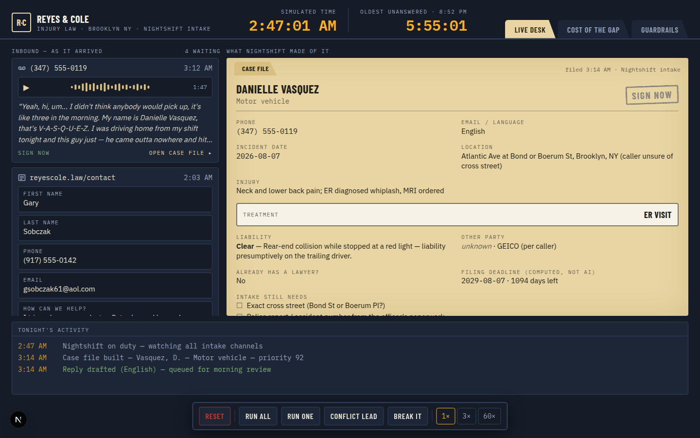
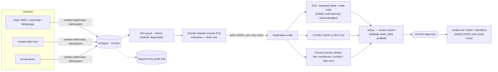

# Nightshift — 24/7 AI intake for personal-injury firms

Nightshift answers a small PI firm's intake channels around the clock. Inquiries arrive as
voicemail, SMS, WhatsApp, email, or the firm's web form — at 3 AM, in whatever shape the
client sends them. Nightshift reads each one, extracts a structured case file, scores it,
checks it against the firm's conflict list, computes the filing deadline from a reviewed
table (never from the model), and drafts a first reply that **waits for a human to approve**.
The firm wakes up to organized cases instead of a chaotic inbox.

One deployment serves every firm: attorneys sign up self-serve at `/signup`, get a working
intake form immediately, and are walked through the rest by an onboarding checklist (and by
you — the `/operator` console tracks each firm's remaining steps and provisions their phone
number). Every row and every query is scoped by firm; cross-tenant access is covered by the
isolation checks in the E2E suite.



## Quick start

```bash
npm install
cp .env.example .env.local     # add your ANTHROPIC_API_KEY
npm run dev                    # → http://localhost:3000 → /signup creates your first firm
```

No database setup needed locally — an embedded Postgres (PGlite) persists to `./data/pg`;
production points `DATABASE_URL` at real Postgres. Signup includes email verification, and
a 14-day trial + Stripe subscription kick in once Stripe keys are configured (free
otherwise). Deploying to Vercel click-by-click: **[DEPLOY-VERCEL.md](DEPLOY-VERCEL.md)**.
Docker/VPS, channel wiring (Twilio/SendGrid), backups, and the go-live checklist:
**[DEPLOY.md](DEPLOY.md)**. The original filmable sales demo — seeded leads, simulated
2:47 AM clock, break-it button — is intact: `NIGHTSHIFT_MODE=demo npm run dev`, or `/demo`
on a live instance (behind login).

## Architecture



**The trust boundary is the product.** The model extracts and drafts; code decides:

- `statuteOfLimitations` — computed from `lib/sol-table.ts` + date arithmetic, and hidden
  from reviewers until an attorney reviews the table and acknowledges it in Settings
- `conflictFlags` — matched against the firm-managed conflict list; a match holds the
  reply and requires an admin to release it
- `needsHumanReview` — forced on low confidence, any conflict, or a sign-now routing
- **Nothing sends itself.** Every outbound reply is a human clicking Approve on the review
  screen; the reviewer can edit the draft first, and the edit is audited
- **Real leads never get canned answers.** If extraction fails after retries, the lead is
  flagged `needs attention` with the raw message — the demo's cached fallbacks exist only
  in demo mode
- Unconfigured channels run **visibly simulated** — the pipeline works end to end, marked
  "simulated" instead of pretending to deliver
- Every consequential action — machine or human — lands in an append-only audit trail

## The CaseFile schema

```ts
interface CaseFile {
  caseType: "motor_vehicle" | "premises_liability" | "dog_bite"
    | "medical_malpractice" | "workers_comp" | "product_liability"
    | "other" | "not_a_case";
  incidentDate: string | null;              // ISO date
  incidentLocation: string | null;
  claimant: {
    name: string | null; phone: string | null;
    email: string | null; preferredLanguage: string | null;
  };
  injuryDescription: string | null;
  treatmentStatus: "er_visit" | "ongoing_treatment" | "saw_doctor_once"
    | "no_treatment" | "unknown";
  liabilityClarity: "clear" | "disputed" | "unclear";
  liabilityNote: string;
  otherPartyInfo: { name: string | null; insurer: string | null; policyLimits: string | null };
  priorRepresentation: boolean | "unknown";
  statuteOfLimitations: {                   // ★ computed by code, never the model
    jurisdiction: string | null; deadlineISO: string | null;
    daysRemaining: number | null; basis: string | null;
  };
  priorityScore: number;                    // 0–100
  scoreRationale: string;                   // one plain-English sentence
  routing: "sign_now" | "schedule_consult" | "nurture" | "decline";
  missingInfo: string[];                    // what intake still needs to ask
  conflictFlags: string[];                  // ★ computed by code, never the model
  confidence: number;                       // 0–1
  needsHumanReview: boolean;                // ★ forced by code per review rules
}
```

## Tests

```bash
npx vitest run     # parser, SOL math, conflict matching, review forcing, reply routing
```

## This is intake software, not legal software

- **The SOL table ships as illustrative data.** `lib/sol-table.ts` ignores discovery
  rules, tolling, municipal notice-of-claim deadlines, and every exception that makes
  deadlines an attorney's job. The product enforces this honestly: deadline countdowns
  stay hidden until an attorney reviews the table and acknowledges it in Settings —
  and verifying it against current law is that attorney's responsibility, per release.
- **No legal advice, by construction.** The system prompt (rendered verbatim on the
  Guardrails screen from `lib/guardrails.ts`) forbids legal advice, case-value estimates,
  and any implication of an attorney-client relationship. The disclaimer on every reply is
  appended by application code in the sender's language.
- **A human approves everything**, and the audit trail proves who approved what, when,
  edited or not.
- Names, parties, and matters in the demo seed data are fictional.

## License

MIT — see [LICENSE](LICENSE).
