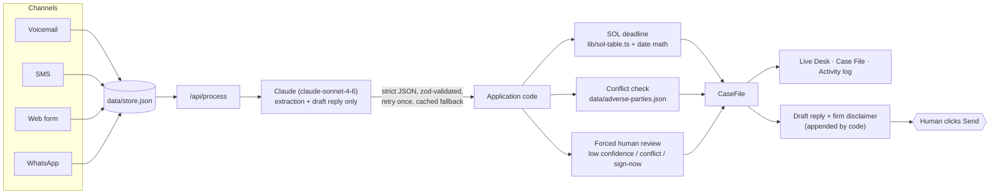

# Nightshift — 24/7 AI intake for personal-injury firms

Nightshift is a filmable product demo of an overnight intake engine for a small personal-injury firm (the fictional **Reyes & Cole Injury Law**, Brooklyn NY). Inbound inquiries arrive at all hours in whatever form the client sends — a 3 AM voicemail, an all-caps text, a half-empty web form, a WhatsApp message in Spanish. Nightshift reads each one, extracts a structured case file, scores it, decides whether to pursue, checks it against the firm's conflict list, and drafts a first reply that waits for a human to approve. The firm wakes up to organized cases instead of a chaotic inbox.


*(Live Desk at 1440×900 — replace `docs/screenshot.png` with fresh captures as the build evolves)*

## Setup

```bash
npm install
cp .env.example .env.local   # add your ANTHROPIC_API_KEY
npm run dev
```

That's the whole setup. Without an API key the app still runs end to end on cached pre-computed results — extraction, conflict checks, the break-it failure, all of it — so the demo never dead-ends.

## Architecture



The trust boundary is the point of the design: the model **extracts**; code **decides**. Three fields are never model output:

- `statuteOfLimitations` — computed from a reviewed table (`lib/sol-table.ts`) plus date arithmetic
- `conflictFlags` — name-matched against `data/adverse-parties.json`
- `needsHumanReview` — forced `true` on confidence < 0.7, any conflict, or a sign-now routing

## The CaseFile schema

```ts
interface CaseFile {
  caseType: "motor_vehicle" | "premises_liability" | "dog_bite"
    | "medical_malpractice" | "workers_comp" | "product_liability"
    | "other" | "not_a_case";
  incidentDate: string | null;              // ISO date
  incidentLocation: string | null;
  claimant: {
    name: string | null; phone: string | null;
    email: string | null; preferredLanguage: string | null;
  };
  injuryDescription: string | null;
  treatmentStatus: "er_visit" | "ongoing_treatment" | "saw_doctor_once"
    | "no_treatment" | "unknown";
  liabilityClarity: "clear" | "disputed" | "unclear";
  liabilityNote: string;
  otherPartyInfo: { name: string | null; insurer: string | null; policyLimits: string | null };
  priorRepresentation: boolean | "unknown";
  statuteOfLimitations: {                   // ★ computed by code, never the model
    jurisdiction: string | null; deadlineISO: string | null;
    daysRemaining: number | null; basis: string | null;
  };
  priorityScore: number;                    // 0–100
  scoreRationale: string;                   // one plain-English sentence
  routing: "sign_now" | "schedule_consult" | "nurture" | "decline";
  missingInfo: string[];                    // what intake still needs to ask
  conflictFlags: string[];                  // ★ computed by code, never the model
  confidence: number;                       // 0–1
  needsHumanReview: boolean;                // ★ forced by code per review rules
}
```

Model output is parsed defensively (`lib/extract.ts`): fences stripped, outermost JSON object extracted, zod-validated. A failed parse retries once with the validation error fed back; a second failure falls back to a cached pre-computed result for that lead (logged to the console, never surfaced in the UI).

## Demo controls

Floating bar (keyboard-accessible): **Reset** (`R`) wipes all processed state, restores seeds, and resets the clock to 2:47 AM · **Run all** (`A`) · **Run one** (`N`) · **Conflict lead** (`C`) · **Break it** (`B`) injects a lead with a malformed date so the parser genuinely fails and the retry genuinely recovers · clock speed `1` / `3` / `6` (1×, 3×, and a 60× cold-open speed that carries the clock from 2:47 to the 3:12 AM voicemail in 25 seconds).

## This is a demo, not legal software

- **The SOL table is illustrative.** `lib/sol-table.ts` contains simplified limitations periods for a handful of states and ignores discovery rules, tolling, municipal notice-of-claim deadlines, and every other exception that makes this an attorney's job. It exists to demonstrate an architecture — deadlines from reviewed tables and date math, never from a language model. Verify anything real against official sources.
- **No legal advice, by construction.** The system prompt (shown verbatim on the Guardrails screen, imported from `lib/guardrails.ts`) forbids legal advice, case-value estimates, and any implication that an attorney-client relationship exists. The disclaimer on every draft reply is appended by application code — the model never controls it.
- **A human approves everything.** Nothing is signed or sent by the system. Sign-now routings, conflicts, and low-confidence extractions are force-flagged for review, and the Send button is a person.
- All names, parties, and matters in the seed data are fictional.

## License

MIT — see [LICENSE](LICENSE).
